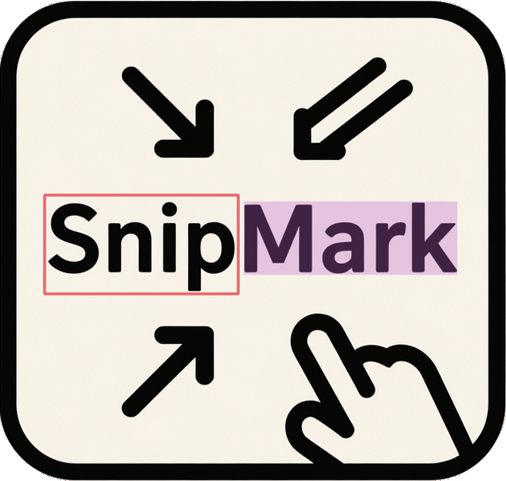

## About

Have you been working in QubesOS and realize that you need a quick screenshot of what you are working on? QubesOS doesn't make anything "quick"!

SnipMark for QubesOS is a single-script "application" that allows you to:
1. mark up a screenshot with boxes, arrows, highlights, blurs, and text
2. save it or send it to another App VM where you might be working and need a screenshot.

It is a single small Python file using PyQt5 as a GUI, which is *already installed in dom0*!  NO OTHER SOFTWARE REQUIRED!

## Installing

1. git clone into an AppVM or Disposable VM as you wish
2. Copy just 1 or 2 files together into dom0 (you can omit the icon png if you wish):

    ```bash
    qvm-run --pass-io source-vm-name "cat /path/to/snipmark/snipmark_qubesos.py" > "/path/in/dom0/snipmark_qubesos.py"
    qvm-run --pass-io source-vm-name "cat /path/to/snipmark/snipmark.png" > "/path/in/dom0/snipmark.png"
    chmod +x /path/in/dom0/snipmark_qubesos.py
    ```

3. Add a new item to your panel and add a new Launcher:
    - Name: SnipMark
    - Command: /path/in/dom0/snipmark_qubesos.py
    - Icon: (if you wish) choose the png icon for SnipMark

## Usage

Most of the features should be pretty self-explanatory if you've ever used any other screenshot mark up tool, but you can:
- Crop
- Highlight text
- Add boxes to call out something
- Add arrows to call out something
- Blur sensitive text, etc.
- Add Text

Each tool uses the selected color and line width (defaults can be changed where indicated within the Python script)

Once complete, your image can either be saved, or sent as a file to the ~/QubesIncoming/dom0 folder of the VM of your choice using the "Qubes target VM:" select list in the bottom toolbar.